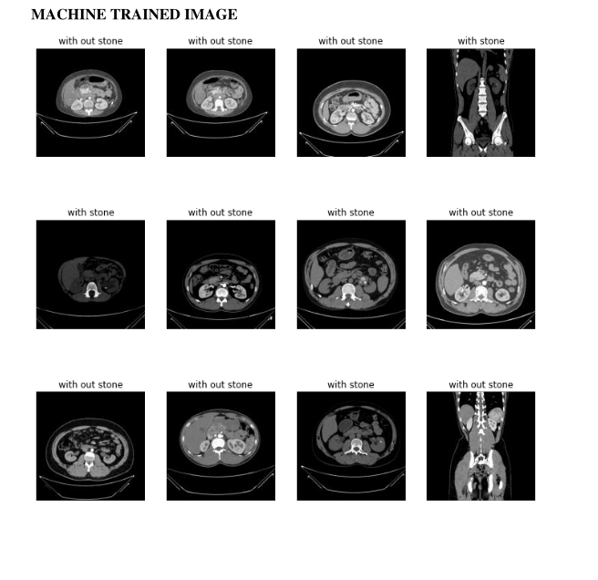

# Kidney Stone Detection using Image Processing and CNN

This project focuses on the detection of kidney stones from ultrasound images using Digital Image Processing techniques and Convolutional Neural Networks (CNN). The primary aim is to provide an automated and accurate method to identify the presence of kidney stones in medical imagery, enabling early diagnosis and treatment.

---

## 🧠 Project Motivation

Kidney stone disease is a critical health issue that can lead to severe complications if not detected early. Ultrasound imaging is a widely used, non-invasive, and cost-effective method to diagnose kidney conditions. However, due to low image contrast and speckle noise, detecting kidney stones manually is challenging. This project leverages advanced image processing techniques and deep learning models to automate this process effectively.

---

## 📷 Methodology

The proposed system is divided into four main stages:

1. **Image Pre-processing**
   - Noise removal using Gaussian filtering
   - Smoothing and contrast enhancement

2. **Image Segmentation**
   - Canny Edge Detection algorithm
   - Non-max suppression and thresholding

3. **Feature Extraction**
   - Wavelet transform for texture and energy level extraction

4. **Classification**
   - Convolutional Neural Network (CNN) trained on ultrasound images
   - CNN architecture includes multiple convolution, pooling, and fully connected layers
   - Activation functions: ReLU, Sigmoid
   - Achieved classification accuracy: **70–85%**

---

## 🛠 Technologies Used

- **Language**: Python 3.6+
- **Libraries**: OpenCV, NumPy, Matplotlib
- **Deep Learning Framework**: TensorFlow / Keras
- **IDE**: PyCharm
- **Development Environment**: Anaconda Navigator, Jupyter Notebook

---

## 💻 System Requirements

### Software:
- OS: Windows 10 / macOS / Linux
- IDE: PyCharm or Jupyter Notebook
- Python: Version 3.6+
- Libraries: `opencv-python`, `tensorflow`, `numpy`, `matplotlib`, etc.

### Hardware:
- RAM: Minimum 4 GB
- Storage: Minimum 10 GB
- Processor: Intel Pentium 4 or better

---

## 📈 CNN Architecture (Simplified)

- **Input Layer**: 227x227x3 color images
- **Conv Layers**: Multiple filters (11x11, 5x5, 3x3) with ReLU
- **Max Pooling**: 3x3 stride
- **Fully Connected Layers**: FC-1 (4096), FC-2 (4096), FC-3 (1000)
- **Output**: Binary classification (`Stone Present` / `Stone Absent`)

---

## 🧪 Testing

Testing was carried out at multiple levels:
- **Unit Testing**: Verified each module's logic.
- **Integration Testing**: Checked data flow between modules.
- **Functional Testing**: Ensured system behavior aligned with expectations.
- **Black Box & White Box Testing**: For general and in-depth logic analysis.

---

## 📷 Snapshots

- Preprocessed images
- Segmented output with edge detection
- CNN output for multiple ultrasound samples
  

---

## 🔮 Future Work

- Localize stone region and estimate size
- Integrate the model into a mobile or web-based diagnostic tool
- Improve classification accuracy with larger datasets

---

## 📚 References

1. K. Viswanath et al., “Kidney Stone Detection via Level Set Segmentation and ANN,” 2014.
2. P. Tamilselvi, “Early Detection of Kidney Stones using Region Growing,” 2011.
3. Jyoti Verma et al., “Detection using KNN & SVM,” 2017.
4. Nur Farhana Rosli et al., “Automated Renal Size Estimation,” 2018.

---

## 📩 Contact

**Developed by:** Dept. of Computer Science & Engineering  
**Institution:** D.A.C.G. Govt. Polytechnic, Chikkamagaluru  
**Academic Year:** 2021–2022  

**Contributors:**
- Nikhil S G  
- Poornachandra  
- Prathik  
- Puneeth  
- Sanjushree

